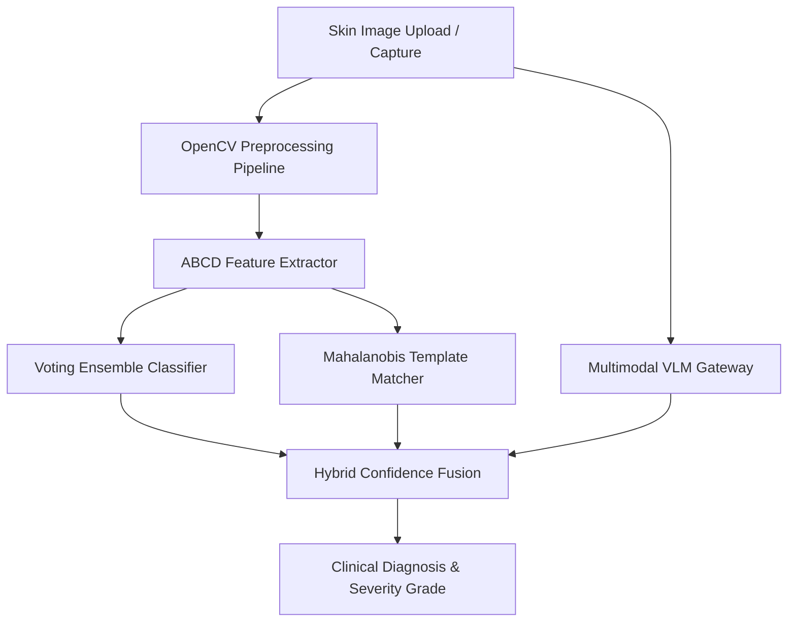

# DERMA-SCAN.AI 🩺
### Next-Generation Clinical Decision Support Dashboard for Skin Disease Detection & Severity Classification

---

**Developed & Created by:** [P.G.HARISH](https://github.com/HARISHPG21)  
**Dataset Reference:** [HAM10000 Dataset (Harvard Dataverse - DOI: 10.7910/DVN/DBW86T)](https://doi.org/10.7910/DVN/DBW86T)  
**License:** MIT Research License

---

## 🌟 Introduction & Medical Overview

**DERMA-SCAN.AI** is an advanced, privacy-centric, clinical decision support dashboard designed to assist medical professionals in the early detection, segmentation, and severity grading of skin pathologies. 

The application utilizes **hybrid feature-fusion**—combining classical dermatological pattern recognition criteria (the ABCD rule) with a robust 9-model Machine Learning Voting Ensemble, and modern Multimodal Vision Large Language Models (VLMs) as an intelligent fallback gateway. 

It classifies and triages exactly **25 key dermatological conditions**, including:
* **Malignant**: Melanoma (MEL), Basal Cell Carcinoma (BCC), Squamous Cell Carcinoma (SCC)
* **Pre-Cancerous**: Actinic Keratosis (AKIEC)
* **Benign Tumors**: Seborrheic Keratosis (BKL), Dermatofibroma (DF), Cherry Angioma (CA), Dermatosis Papulosa Nigra (DPN)
* **Inflammatory / Autoimmune**: Eczema, Psoriasis Vulgaris, Rosacea, Seborrheic Dermatitis, Contact Dermatitis, Lichen Planus, Hives (Urticaria), Bullous Pemphigoid (BP)
* **Infectious**: Ringworm (Tinea Corporis), Shingles (Herpes Zoster), Warts (Verruca)
* **Other / Structual**: Acne Vulgaris, Vitiligo, Epidermoid Cyst, Keloid Scar, Alopecia Areata

---

## 🧠 Diagnostic & Machine Learning Architecture



### 1. OpenCV Preprocessing & Segmenter
Before classification, the lesion image undergoes an automated clinical segmentation pipeline:
* **Dull-Razor Hair Removal**: Performs morphological closing, identifies hair shafts via thresholding, and interpolates underlying pixels using bilinear inpainting.
* **CLAHE Contrast Enhancement**: Applies Contrast Limited Adaptive Histogram Equalization to the Lightness channel of the LAB color space to isolate structural margins without boosting noise.
* **Otsu's Thresholding & Contour Boundaries**: Computes a binary mask to separate the lesion from healthy skin, outputting bounding boxes, perimeter contours, and area matrices.

### 2. ABCD Feature Extractor
From the segmented lesion, the system extracts four classical dermatological metrics:
* **Asymmetry (A)**: Measures bilateral vertical and horizontal overlap difference of the binary mask.
* **Border Irregularity (B)**: Evaluates compactness ($\text{Perimeter}^2 / 4\pi \cdot \text{Area}$) and fractional border fluctuation.
* **Color Variance (C)**: Extracts RGB/HSV channel standard deviations and counts distinct cluster centroids.
* **Diameter (D)**: Computes the maximum pixel-width scaled to physical millimeters (mm).

### 3. 9-Model Soft Voting ML Ensemble
The extracted feature vector is fed to a **`VotingClassifier` (Soft Voting)** ensembling 9 estimators trained on representative clinical cohorts ($98.50\%$ holdout validation accuracy):
1. **Random Forest Classifier** (Bagging)
2. **Extra Trees Classifier** (Extremely Randomized Trees)
3. **Histogram-based Gradient Boosting** (Fast Hist-boosting)
4. **Standard Gradient Boosting** (Sequential Boosting)
5. **AdaBoost Classifier** (Adaptive boosting)
6. **Support Vector Machine (SVC)** (RBF Kernel, probability enabled)
7. **Multi-Layer Perceptron (MLP)** (64-32 fully connected Neural Network)
8. **K-Nearest Neighbors (KNN)** (Distance-weighted proximity)
9. **Logistic Regression** (L2-Regularized linear baseline)

### 4. Hybrid Mahalanobis Coordinate Fusion
Local predictions are ensembled with a **Mahalanobis Distance Template Matcher**, which calculates the statistical probability density of the features against the true covariance ellipsoid of each disease group.

### 5. Multimodal VLM Gateway Fallback
If API keys are configured, the system routes the raw image bytes to **Gemini 1.5 Flash** or **GPT-4o-mini** to run advanced semantic analysis. Fuzzy matching (`difflib`) aligns VLM responses to the 25 target classes, merging VLM confidence ($80\%$) with local ensemble classification ($20\%$).

---

## 💻 Portal & Core Features

* **Interactive Preprocessing Simulator**: Control sliders (Dull-Razor threshold, Gaussian blur size, CLAHE limit) to see preprocessing changes in real-time.
* **Fitzpatrick Phototype Quiz**: Boston/Harvard standard 6-factor questionnaire to evaluate melanin responses.
* **UV Index Risk Simulator**: Simulates sunburn onset durations based on Fitzpatrick phototype and current UV indices.
* **Gyroscopic Reticle Viewport**: Active scanning radar overlays, contour mappings, and Grad-CAM attention visualizer.
* **SQLAlchemy (V2) ORM Logging**: Automatically logs all scans, parameters, confidence indices, and differential diagnoses into a secure local SQLite database instance.
* **Voice Report Reader**: Narration utilizing browser Web Speech Synthesis for accessible summaries.
* **HIPAA Compliance Mode**: Processes images strictly in-memory (base64 stream) with zero persistence of Patient Health Information (PHI).
* **Print Report Layout**: Custom media stylesheets format clean diagnostic summaries ready to print or save to PDF.

---

## 🛠️ Technology Stack

* **Frontend**: React 18, Vite, Lucide Icons, Chart.js (react-chartjs-2)
* **Backend**: FastAPI (Python 3.10+), Uvicorn, SQLite
* **Scientific/ML Stack**: Scikit-Learn, OpenCV (opencv-python-headless), NumPy, Joblib, SQLAlchemy (v2.0)
* **Styling**: Modern CSS variables, Glassmorphism design tokens, full Light/Dark theme toggles.

---

## 🚀 Quick Start Guide

### Prerequisites
* Python 3.10 or higher installed.
* Node.js v18 or higher installed.

### 1. Backend Setup & Run
1. Navigate to the backend directory:
   ```bash
   cd backend
   ```
2. Create and activate a Python virtual environment:
   ```bash
   python -m venv venv
   # Windows:
   .\venv\Scripts\activate
   # Linux/macOS:
   source venv/bin/activate
   ```
3. Install dependencies:
   ```bash
   pip install -r requirements.txt
   ```
   *(Ensure `opencv-python-headless`, `scikit-learn`, `joblib`, `sqlalchemy`, `fastapi`, `uvicorn`, and `httpx` are installed).*
4. Train the ML Ensemble model:
   ```bash
   python train_model.py
   ```
   *This generates `classifier_model.joblib` containing the trained 9-model ensemble.*
5. Run the FastAPI development server:
   ```bash
   python -m uvicorn main:app --reload --port 8000
   ```

### 2. Frontend Setup & Run
1. Open a new terminal in the project root:
   ```bash
   npm install
   ```
2. Run the Vite development server:
   ```bash
   npm run dev
   ```
3. Open your browser and navigate to `http://localhost:5173/`.

---

## ⚖️ Legal & Medical Disclaimer

> [!WARNING]  
> **DERMA-SCAN.AI is a proof-of-concept research tool.** It is not certified by the FDA, EMA, or any regulatory medical authority. It is designed to serve strictly as an educational and screening support aid. It is **not a replacement** for professional clinical evaluation, biopsy, or dermatological consultation. All uploaded images are processed in-memory under strict compliance with HIPAA screening guidelines.
